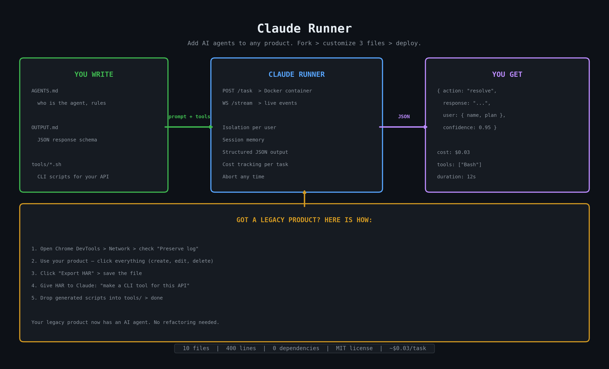

# Claude Runner

Run AI agents in isolated Docker containers. Fork → customize → deploy.



## Why

You're building a product where users interact with an AI agent — a website builder, support bot, code reviewer, data pipeline. You need:

- **Isolation** — each user gets their own container, can't affect others
- **Custom tools** — agent calls your APIs via shell scripts you write
- **Structured output** — you define JSON schema, agent returns it
- **Cost tracking** — know exactly how much each task costs
- **Session memory** — agent remembers previous interactions
- **Real-time streaming** — show users what the agent is doing via WebSocket
- **Abort** — kill any task instantly

Claude Runner gives you all of this in **one file** (`server.mjs`, ~400 lines, zero dependencies).

## Quick Start

> **📖 Detailed walkthrough: [QUICKSTART.md](QUICKSTART.md)**

```bash
git clone https://github.com/Hormold/claude-runner
cd claude-runner
docker build -t claude-runner .
export CLAUDE_CODE_OAUTH_TOKEN="sk-ant-oat..."
node server.mjs
```

```bash
curl -X POST http://localhost:3456/task \
  -H "Content-Type: application/json" \
  -d '{"sessionId":"user-1","message":"Hello, what can you do?"}'
```

## Architecture

```
┌──────────────────────────────────────────────────────────────┐
│  Your Application (frontend + backend)                       │
│                                                              │
│  ┌─────────────┐    ┌──────────────┐    ┌──────────────────┐ │
│  │ Web UI      │───▶│ Your Backend │───▶│ Claude Runner    │ │
│  │             │◀──▶│              │    │ POST /task       │ │
│  │ WebSocket   │    │ - auth       │    │ WS /stream/:id   │ │
│  │ for live    │    │ - billing    │    │                  │ │
│  │ updates     │    │ - rate limit │    │ Manages:         │ │
│  └─────────────┘    └──────────────┘    │ - Docker         │ │
│                                         │ - Sessions       │ │
│                                         │ - Queue          │ │
│                                         │ - Streaming      │ │
│                                         └────────┬─────────┘ │
└───────────────────────────────────────────────────┼──────────┘
                                                    │
                    ┌───────────────────────────────┼──────────┐
                    │  Docker Container (per task)  │          │
                    │                               ▼          │
                    │  /workspace/                             │
                    │    AGENTS.md    ← agent prompt           │
                    │    OUTPUT.md    ← output schema          │
                    │    tools/       ← your CLI scripts       │
                    │    data/        ← agent workspace        │
                    │                                          │
                    │  Claude Agent SDK                        │
                    │    reads prompts → runs tools → JSON     │
                    │                               │          │
                    └───────────────────────────────┼──────────┘
                                                    │
                    ┌───────────────────────────────┼──────────┐
                    │  Your External APIs           ▼          │
                    │  (CRM, deployment, database, etc.)       │
                    │  Called via tools/acme-cli.sh + curl     │
                    └──────────────────────────────────────────┘
```

## API Reference

### `POST /task` — Submit Task

```json
{
  "sessionId": "user-123",
  "message": "Look up my account, email is alice@startup.io",
  "context": "Channel: web-chat",
  "env": { "ACME_API_URL": "http://host.docker.internal:3457", "ACME_API_TOKEN": "secret" }
}
```

**Response:**
```json
{
  "taskId": "a1b2c3d4",
  "sessionId": "user-123",
  "output": {
    "action": "resolve",
    "response": "Hi Alice! You have 188 calls remaining on the Growth plan.",
    "user": { "name": "Alice Chen", "email": "alice@startup.io", "plan": "growth" },
    "confidence": 1.0
  },
  "cost": 0.034,
  "duration": 20665,
  "tools": ["Bash"],
  "resumed": false
}
```

| Field | Type | Description |
|-------|------|-------------|
| `sessionId` | string | Required. Reuse to continue a conversation |
| `message` | string | Required. The user's message |
| `context` | string | Optional. Extra context (channel, user info) |
| `env` | object | Optional. Env vars passed to Docker container |

### `POST /task/:sessionId/abort` — Abort Task
Kills the Docker container immediately. Rejects all queued tasks for this session.

### `GET /sessions` — List All Sessions
Returns array of sessions with state, busy status, and queue depth.

### `GET /session/:id` — Session Details
### `DELETE /session/:id` — Delete Session (kills container + wipes data)
### `POST /session/:id/reset` — Reset to Clean State (re-copies agent/ template)
### `GET /health` — Health Check

### `WS /stream/:sessionId` — Live Event Stream

Connect via WebSocket to receive real-time events:

```javascript
const ws = new WebSocket('ws://localhost:3456/stream/user-123');

ws.onmessage = ({ data }) => {
  const event = JSON.parse(data);
  switch (event.type) {
    case 'connected':     // {busy, turns}
    case 'task_start':    // {taskId, sessionId}
    case 'init':          // {sessionId, model, tools}
    case 'thinking':      // {text} — partial thinking tokens
    case 'text':          // {text} — partial output text
    case 'tool_start':    // {tool, input}
    case 'tool_end':      // {result}
    case 'task_complete': // {taskId, output, cost, duration, tools}
    case 'abort':         // {taskId}
  }
};
```

Connect **before** sending `/task` to catch all events.

## Customization Guide

### Agent Prompt (`agent/AGENTS.md`)
Who the agent is. What tools it has. What rules it follows.

### Output Format (`agent/OUTPUT.md`)
JSON schema the agent must return. Written in plain English — the agent reads it as part of its prompt.

### Tools (`agent/tools/*.sh`)
Shell scripts that call your APIs. They receive arguments, read env vars, output JSON.

```bash
#!/bin/bash
# tools/deploy.sh <environment>
curl -s -X POST -H "Authorization: Bearer $DEPLOY_TOKEN" \
  "$PLATFORM_API/deploy" -d "{\"env\":\"$1\"}"
```

### Environment Variables
Pass per-session secrets in `env` field of `/task`. Available inside Docker as normal env vars.

## File Structure

```
claude-runner/
├── server.mjs        ← Task coordinator (HTTP + WebSocket, ~400 lines)
├── Dockerfile         ← Docker image (Node.js + Claude SDK + curl)
├── agent/             ← Agent template (customize this!)
│   ├── AGENTS.md      ← Agent prompt
│   ├── OUTPUT.md      ← Output JSON schema
│   └── tools/         ← CLI scripts for the agent
├── mock-api.mjs       ← Example external API (for testing)
├── test.sh            ← Full end-to-end test
├── QUICKSTART.md      ← Step-by-step guide
├── CLAUDE.md          ← Instructions for AI agents working on this repo
├── .env.example       ← Environment variables template
└── LICENSE            ← MIT
```

## Got a Legacy Product? Add AI in an Afternoon

You don't need a clean REST API. If your product has a web UI, you can reverse-engineer its API in minutes and turn it into agent tools.

### Step 1: Record your API with Chrome DevTools

1. Open your product in Chrome
2. Open DevTools (`F12`) → **Network** tab
3. Check **"Preserve log"** (keeps requests across page navigations)
4. Go to **DevTools Settings** (gear icon) → scroll down → check **"Allow to generate HAR with sensitive data"**
5. **Use your product** — click through every feature you want the agent to use:
   - Create things, edit them, delete them
   - Search, filter, sort
   - Change settings, update profiles
   - The more you do, the more the agent will know how to do

6. When done → right-click the Network log → **"Save all as HAR with content"**

### Step 2: Generate CLI tools from HAR

Give the HAR file to Claude and say:

```
Here's a HAR file from our product. Create a CLI tool (bash + curl) that can:
- List, create, update, delete [resources]
- Use environment variables for auth: $API_URL, $API_TOKEN
- Output JSON
- Handle errors

Group related operations into one script with subcommands.
```

Claude will analyze every request/response and generate shell scripts that replicate the API calls.

### Step 3: Handle authentication

The tricky part is auth. Add a note to your prompt:

```
Authentication works like this: [describe your auth flow]
- API key in header: Authorization: Bearer $TOKEN
- Or: session cookie (include how to get it)
- Or: OAuth flow (describe the endpoint)
```

If your product uses simple API keys or bearer tokens — just pass them as env vars. If it uses cookies/sessions, your CLI tool can include a `login` subcommand.

### Step 4: Drop scripts into tools/ and go

```bash
cp generated-cli.sh agent/tools/
chmod +x agent/tools/generated-cli.sh
```

Update `agent/AGENTS.md` with instructions on what the tool does, and you're done. Your legacy product now has an AI agent.

### The key insight

Your product already has the hard part — the business logic, the data, years of development. The agent doesn't need to understand your codebase. It just needs a way to call your API and instructions on when to use it.

## Testing

```bash
./test.sh
```

Starts mock API + server → runs 12 tests → cleans up:
1. Health check
2. New session with tools + structured output
3. Independent session (isolation)
4. Resume session (memory persistence)
5. Sessions list
6. Session details
7. Reset session
8. Delete session
9. WebSocket streaming (80+ events)
10. Workspace isolation

Total cost: ~$0.07 per run.

## FAQ

**Q: What's the difference between `CLAUDE_CODE_OAUTH_TOKEN` and `ANTHROPIC_API_KEY`?**
OAuth tokens (from Claude.ai subscription, `sk-ant-oat*`) → use `CLAUDE_CODE_OAUTH_TOKEN`. API keys (from console.anthropic.com, `sk-ant-api*`) → use `ANTHROPIC_API_KEY`.

**Q: How do tools call my APIs from inside Docker?**
Use `host.docker.internal` as the hostname. The server automatically adds `--add-host=host.docker.internal:host-gateway` to Docker. Your API must bind to `0.0.0.0` (not just localhost).

**Q: Can I use this in production?**
This is a starter template. For production, add: authentication on the API, rate limiting, proper error handling, logging, and consider deploying the server + Docker on a dedicated machine.

**Q: How much does it cost per task?**
Depends on complexity. Simple Q&A: ~$0.01. Tool-heavy tasks: ~$0.03-0.05. The `cost` field in every response gives you exact USD.

**Q: Can I use a different model?**
Set `MODEL=claude-opus-4-6` (or any Anthropic model) in env or `.env`.

## License

MIT — fork it, ship it.
